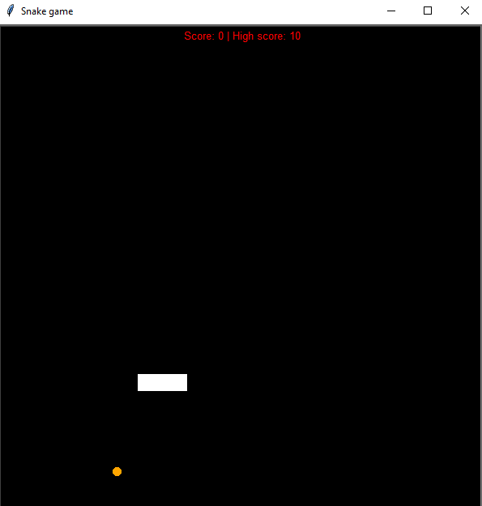

# Snake game
> This is a standard "Snake game" where you score points by "eating" dots that show off on the screen.

## Table of Contents
* [General Info](#general-information)
* [Technologies Used](#technologies-used)
* [Features](#features)
* [Project Status](#project-status)

## General Information
- It's a Python project in which was used a turtle modul. 
- Dots are showing randomly in the screen because of using the random modul. By "eating"dots, snake gets bigger and the score number rises. If the snake hits the wall or if it bites itself game is over. The score board clears.

## Technologies Used
- Python 3.12

## Features
List the ready features here:
- Showing off dots randomly on the screen
- Making another segment of the snake
- Moving the snake
- Showing the high score and the game score

## Project Status
Project is: _complete_ 

